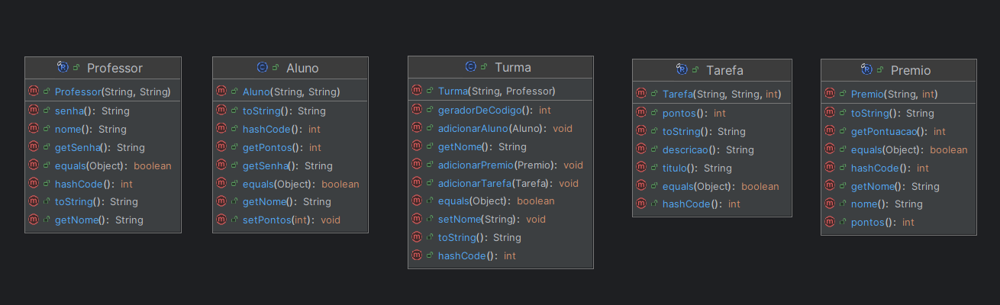
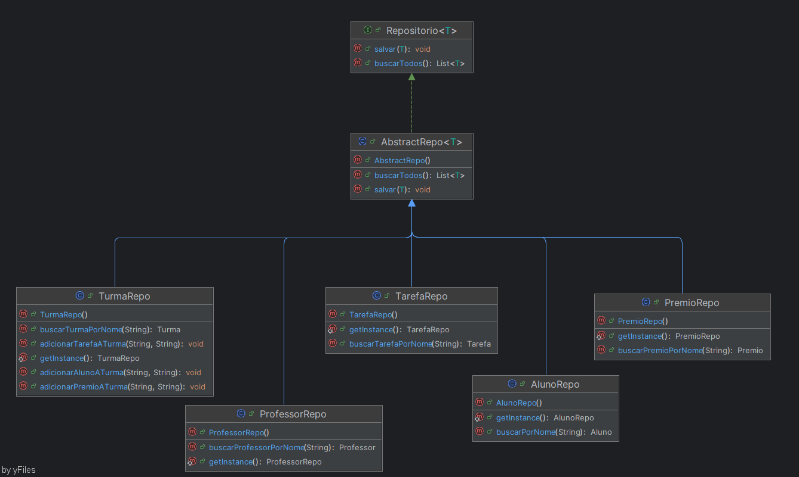
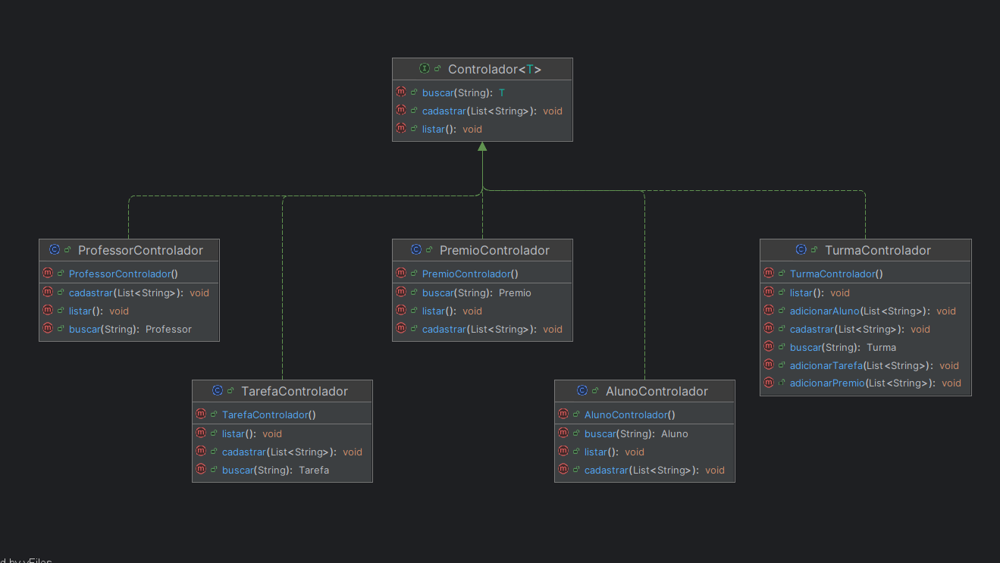
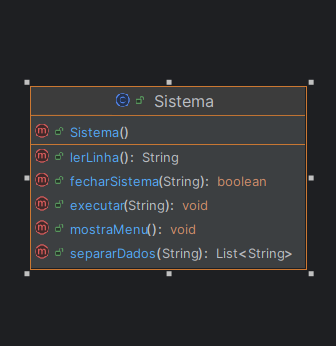
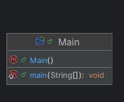

# Propósito do projeto

## Sistema de Turma Gaminificada

Essa é uma didática que tem sido adotada por alguns Professores, com o objetivo de
estimular seus alunos a se dedicarem cada vez mais nos estudos dentro e fora da sala 
de aula.

Com isso Sistema permite criação de Turmas Gameficadas, que tem como proposito permitir 
que professores criem Turmas, onde eles podem cadastrar tarefas e premios para inseri-los
em suas Turmas. Cada Tarefa possuirá uma pontação, que será adquirida pelo aluno
quando finalizada. No final de tudo os Alunos poderam usar os pontos acumulados para
resgatar os Premios adicionados aquela turma.

# Participantes

### Carlo Coradini
### Iadson Vinicius


# Organização do projeto com o respectivo diagrama de classes
O projeto está estruturado em três pacotes principais: Dominio, Repositorio e Controladores.

Dominio: Contém as classes das Entidades que serão necessarias,
essas são: Professor, Aluno, Turma, Tarefa e Premio.
<p align="center">
    
</p>

Repositorio: Contém um repositorio para cada Entidade, ou seja, possui uma lista 
estática e constante para cada uma delas, onde seram cadastradas suas instâncias, 
tendo função similar a um banco de dados.
<p align="center">
    
</p>


Controladores: Contém as classes responsáveis por fazerem o acesso aos repositorios,
executando buscas e envio de dados.
<p align="center">
    
</p>

Além disso, existem as classes Main e Sistema que é reponsavel por, fazer a leitura e impressão de 
dados no console. Enquanto a classe Main é responsavel por manter o sistema operando
até que o usuario decida sair.
<p align="center">
    
    
</p>


# Instruções de como realizar o build
Entre na pasta do projeto como Maven instalado e use o seguinte comando:
````
mvn clean install
````

# Instruções de como executar
Ainda dentro da pasta do projeto digite o seguinte comando para executar:

````
mvn exec:java -Dexec.mainClass="Main"
````

## Regras de uso
Quando executar o programa será exibido o seguinte Menu:
````
1- Cadastrar Professor
2- Cadastrar Aluno
3- Cadastrar Turma
4- Cadastrar Tarefa
5- Cadastrar Premio
6- Adicionar Aluno à Turma
7- Adicionar Tarefa à Turma
8- Adicionar Premio à Turma
menu- Apresenta essa mensagem novamente
sair- Fecha o sistema
````
- ### Cadastar Professor no Sistema
Digite 1 e pressione enter.
Em seguida digite o Nome e a Senha do professor, separados por ';' e um espaço,
por exemplo:
````
iadson vinicius; susto213
````

- ###  Cadastar Aluno no Sistema
Digite 2 e pressione enter.
Em seguida digite o Nome e a Senha do Aluno, separados por ';' e um espaço,
por exemplo:
````
lucas andre; sos123
````

- ###  Cadastar Turma no Sistema
Digite 3 e pressione enter.
Em seguida digite o Nome do Professor e o Nome da Turma, separados por ';' e um espaço,
por exemplo:
````
iadson vinicius; Turma01
````
ATENÇÃO: A Turma só podera ser cadastrada se o Professor já estiver 
cadastrado.

- ###  Cadastar Tarefa no Sistema
Digite 4 e pressione enter.
Em seguida digite o Titulo, Descrição e os Pontos que ela vale, separados por ';' e um espaço,
por exemplo:
````
calcular quadrado; calcule o quadrado dos numeros 2, 3, 4 ,5; 3
````

- ###  Cadastar Premio no Sistema
Digite 5 e pressione enter.
Em seguida digite o Titulo do premio e os pontos necessários para 
resgata-lo, separados por ';' e um espaço,
por exemplo:
````
remover 1 questao da prova; 10
````

- ###  Adicionar Aluno na Turma
Digite 6 e pressione enter.
Em seguida digite o Nome da Turma e Nome do Aluno, separados por ';' e um espaço,
por exemplo:
````
turma01; lucas andre
````

- ###  Adicionar Tarefa na Turma
Digite 7 e pressione enter.
Em seguida digite o Nome da Turma e Nome do Aluno, separados por ';' e um espaço,
por exemplo:
````
turma01; calcular quadrado
````

- ###  Adicionar Premio na Turma
Digite 8 e pressione enter.
Em seguida digite o Nome da Turma e Nome do Aluno, separados por ';' e um espaço,
por exemplo:
````
turma01; remover 1 questao da prova
````

- ###  Listar turmas
Digite 9 e pressione enter. Irá listar todas turmas cadastradas no sisetma.

- ### Mostrar Menu 
````
menu
````

- ### Encerrar o Programa
````
sair
````


